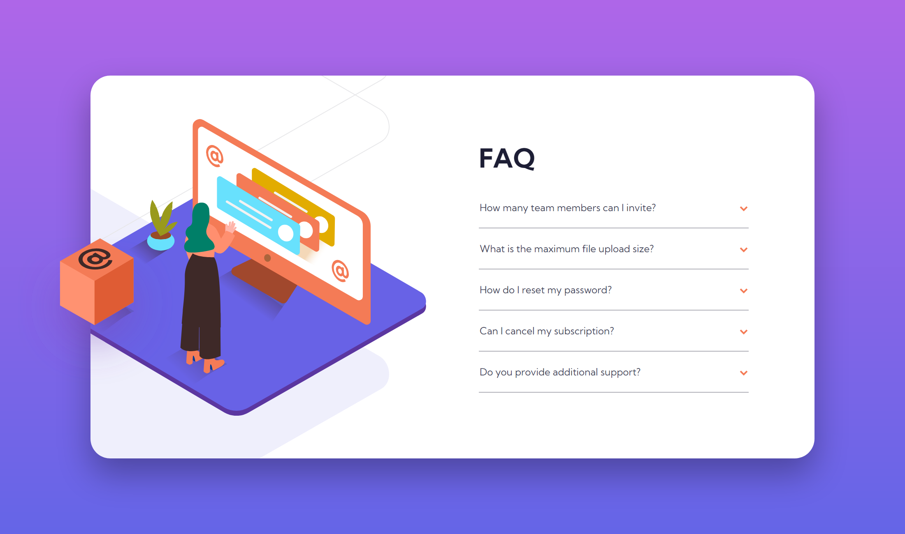

# Frontend Mentor - FAQ accordion card solution

This is a solution to the [FAQ accordion card challenge on Frontend Mentor](https://www.frontendmentor.io/challenges/faq-accordion-card-XlyjD0Oam). Frontend Mentor challenges help you improve your coding skills by building realistic projects.

## Overview

### The challenge

Users should be able to:

- View the optimal layout for the component depending on their device's screen size
- See hover states for all interactive elements on the page
- Hide/Show the answer to a question when the question is clicked

### Screenshot

### Links

- **Solution:** [Frontend Mentor: FAQ accordion](https://www.frontendmentor.io/solutions/faq-accordion-card-add-hash)
- **Live Site:** [https://fem-faq-accordion.pages.dev/](https://fem-faq-accordion.pages.dev/)

## Author

This project was created by **Fortune Iyoha**. If you want to connect with me or view more of my projects, you can visit my [Frontend Mentor profile](https://www.frontendmentor.io/profile/fortune-i-o) or follow me on [𝕏 (formerly Twitter)](https://x.com/fortuneiyoha) for updates and web development discussions.
